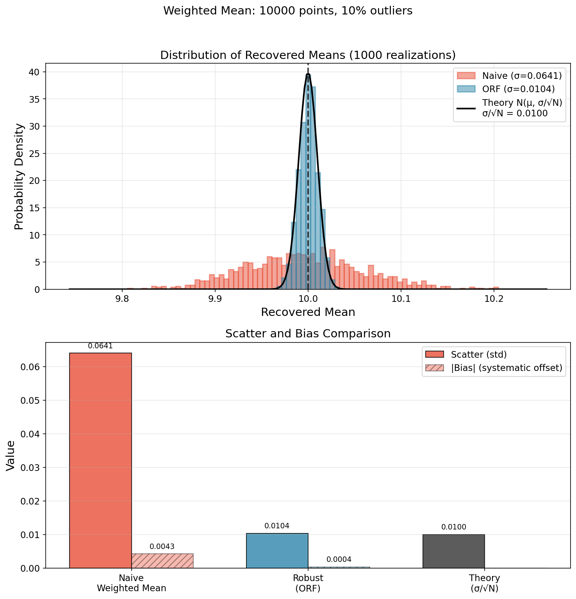
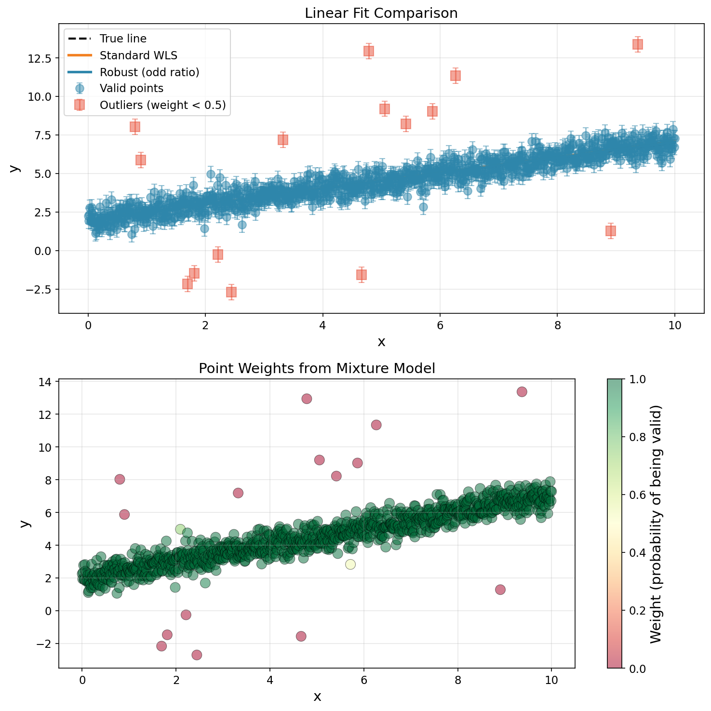
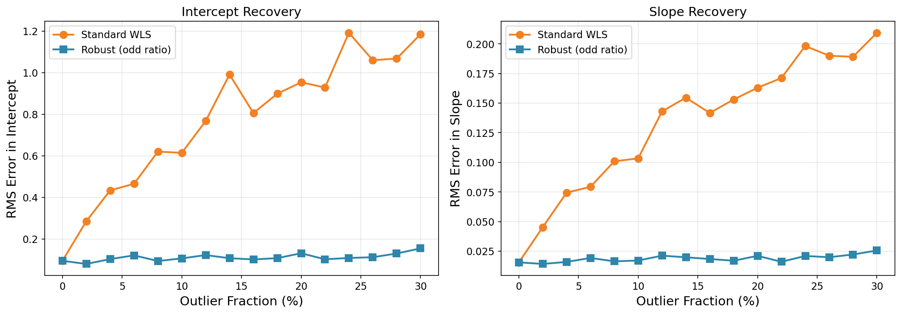
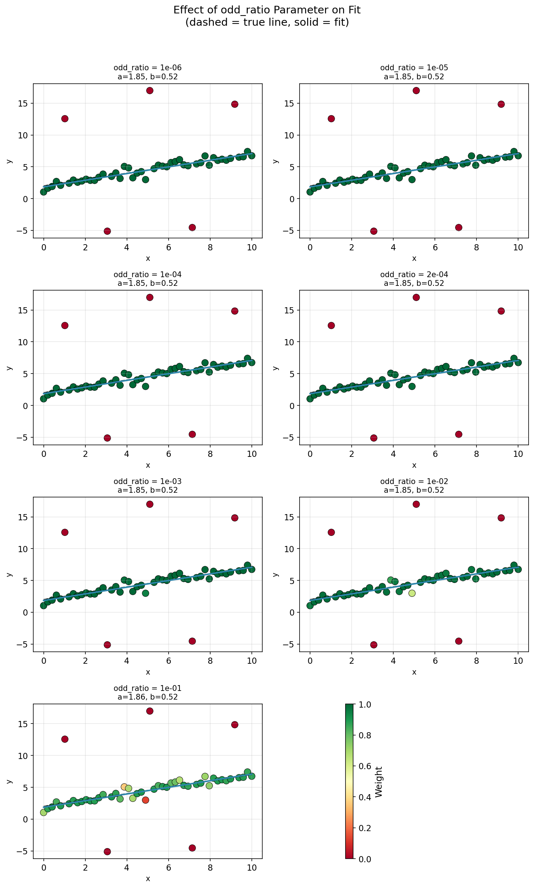
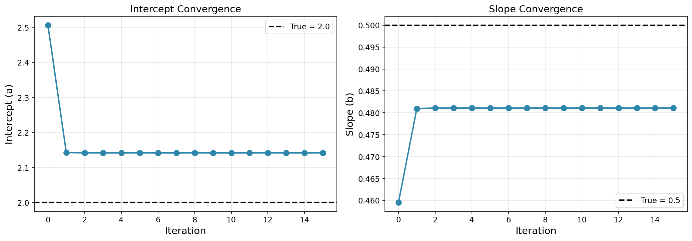
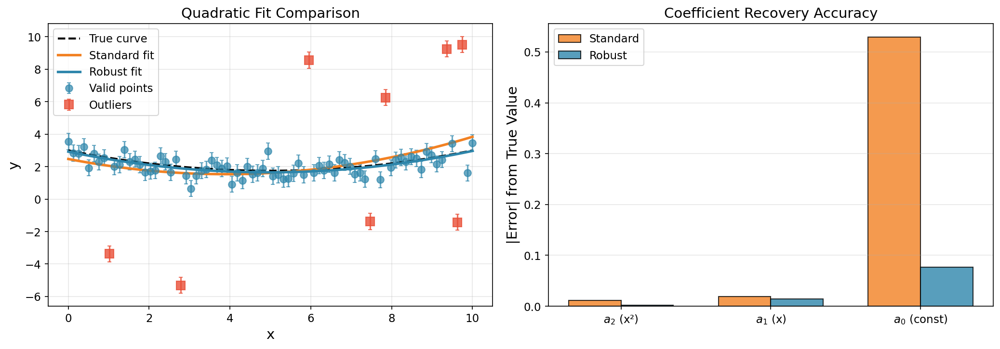
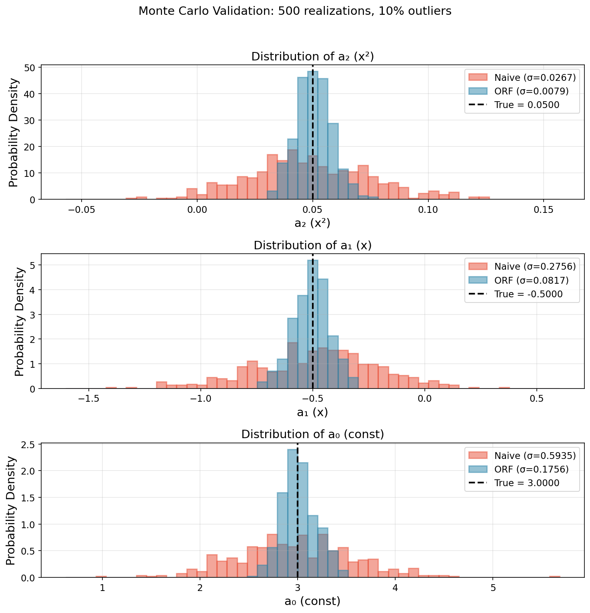
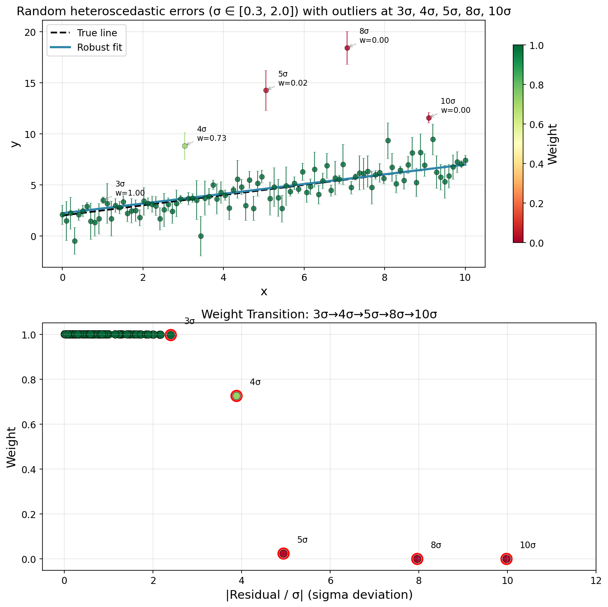
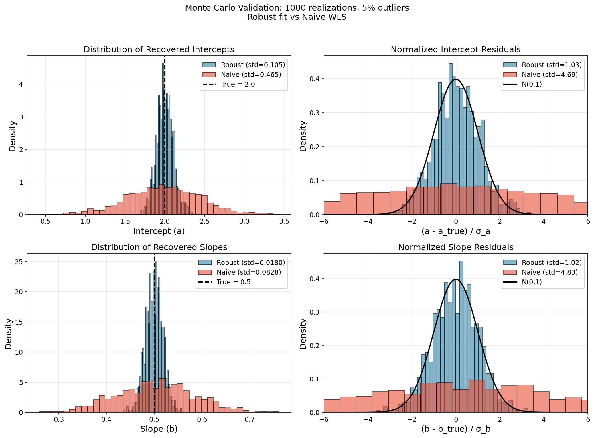
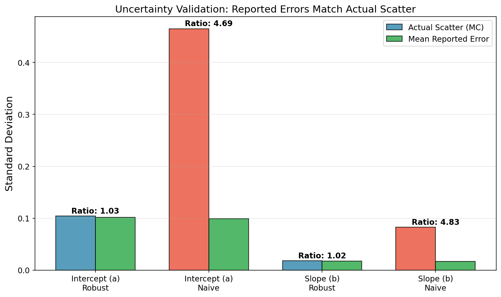

# Odd Ratio Fits

### Robust Weighted Averages, Linear Fits, and Higher-Order Polynomial Fits

[](https://www.python.org/downloads/)
[](https://opensource.org/licenses/MIT)

**Robust fitting using a Gaussian mixture model for outlier rejection.**

This package implements robust fitting algorithms based on the odd ratio weighted mean method from Appendix A of [Artigau et al. (2022)](https://ui.adsabs.harvard.edu/abs/2022AJ....164...84A). The algorithm iteratively down-weights data points that are likely to be outliers while preserving proper statistical uncertainties.

## 🚀 Key Features

- **Robust to outliers**: Automatically identifies and down-weights outlier measurements
- **Proper error propagation**: Returns meaningful uncertainties on fit parameters
- **Handles heteroscedastic data**: Correctly accounts for varying uncertainties across data points
- **No manual sigma-clipping**: Uses a probabilistic mixture model instead of arbitrary thresholds
- **Fast convergence**: Typically converges in 3-5 iterations
- **Flexible**: Works with weighted averages, linear fits, and polynomial fits

## 📦 Installation

Clone and install from source:
```bash
git clone https://github.com/eartigau/odd_ratio_fits.git
cd odd_ratio_fits
pip install -e .
```

## 🔧 Quick Start

### Robust Weighted Mean

```python
import numpy as np
import odd_ratio_fits as orf

# Data with outliers
values = np.array([10.1, 9.8, 10.2, 50.0, 10.0, -20.0, 9.9, 10.3])
errors = np.array([0.5, 0.5, 0.5, 0.5, 0.5, 0.5, 0.5, 0.5])

mean, err = orf.mean(values, errors)
print(f"Robust mean: {mean:.2f} ± {err:.2f}")  # ~10.0, ignoring 50 and -20
```

### Robust Linear Fit

```python
import numpy as np
import odd_ratio_fits as orf

# Generate data with outliers
x = np.linspace(0, 10, 50)
y = 2.0 + 0.5 * x + np.random.normal(0, 0.5, len(x))
yerr = np.ones(len(x)) * 0.5
y[5], y[15], y[25] = 15.0, -5.0, 12.0  # Add outliers

a, a_err, b, b_err = orf.linear(x, y, yerr)
print(f"Intercept: {a:.3f} ± {a_err:.3f}")
print(f"Slope: {b:.3f} ± {b_err:.3f}")
```

## 📖 How It Works

### The Mixture Model Approach

Traditional outlier rejection methods (e.g., sigma-clipping) use hard thresholds to reject points. This can be problematic because:

1. The threshold is arbitrary
2. Points near the threshold may be incorrectly classified
3. Error estimates become biased
4. **Oscillations in iterative algorithms**: Binary inclusion/rejection can cause points to flip in and out of the fit, preventing convergence

By using continuous weights instead of binary decisions, the odd ratio method allows weights to adjust smoothly at each iteration, avoiding jumps and ensuring stable convergence.

The **odd ratio** approach models each data point as coming from a mixture of two distributions:

1. **Valid measurements**: Gaussian distribution centered on the true value
2. **Outliers**: Uniform background distribution

The probability that point $i$ is an outlier given residual $r_i$ and uncertainty $\sigma_i$ is:

$$P(\text{outlier}_i | r_i) = \frac{f_0}{(1-f_0) \cdot \exp\left(-\frac{r_i^2}{2\sigma_i^2}\right) + f_0}$$

where $f_0$ is the prior probability that any point is an outlier (default: $2 \times 10^{-4}$).

### Iterative Algorithm

1. **Initialize** with standard weighted least squares
2. **Compute** residuals from current fit
3. **Calculate** probability of each point being valid
4. **Re-fit** using probability-weighted least squares
5. **Repeat** until convergence

## 📊 Examples and Demonstrations

All plots can be regenerated by running:
```bash
python demo.py
```

Individual demos can also be run separately (see `demo.py` for function names).

---

## Robust Weighted Mean

The foundation of this package is the **robust weighted mean**, which computes a weighted average while automatically down-weighting outliers. This is the building block from which the linear fit is derived.

### Usage

```python
import odd_ratio_fits as orf
import numpy as np

# Values with outliers
values = np.array([10.1, 9.8, 10.2, 50.0, 10.0, -20.0, 9.9])
errors = np.array([0.5, 0.5, 0.5, 0.5, 0.5, 0.5, 0.5])

mean, err = orf.mean(values, errors)
print(f"Robust mean: {mean:.2f} ± {err:.2f}")  # ~10.0, ignoring outliers
```

### Comparison with Standard Methods

**Monte Carlo simulation setup:**
- 1000 independent realizations
- Each realization: 10,000 measurements drawn from N(10, 1) with σ = 1
- 10% outliers (1000 points shifted by ±10 to ±30)
- Compare: naive weighted mean vs ORF robust mean
- **Expected uncertainty from first principles:** σ/√N = 1/√10000 = 0.01

| Method    | Scatter | Abs Bias | Scatter/Error Ratio |
|-----------|---------|----------|---------------------|
| **ORF**   | 0.011   | 0.0004   | **1.06** ✓          |
| Naive     | 0.030   | 0.001    | **3.0** ✗           |

The ORF method achieves the theoretical σ/√N uncertainty even with 10% outliers (uniformly distributed between ±15σ, some overlapping with the main distribution), while naive weighted mean has ~3× larger scatter and underestimates uncertainty by the same factor.



*Reproduce with:* `python -c "from demo import demo_weighted_mean; demo_weighted_mean()"`

---

## Robust Linear Fit

Extending the weighted mean concept to linear regression, `orf.linear` performs $y = a + bx$ fits that are robust to outliers.

### Usage

```python
import odd_ratio_fits as orf
import numpy as np

x = np.linspace(0, 10, 50)
y = 2.0 + 0.5 * x + np.random.normal(0, 0.5, len(x))
yerr = np.ones(len(x)) * 0.5

a, a_err, b, b_err = orf.linear(x, y, yerr)
print(f"Intercept: {a:.3f} ± {a_err:.3f}")
print(f"Slope: {b:.3f} ± {b_err:.3f}")
```

### Comparison with Standard Fit

**Simulation setup:**
- 1,000 points following y = 2 + 0.5x
- **Heteroscedastic errors**: σ varies from 0.3 to 1.5 (see [Heteroscedastic Uncertainties](#-proper-handling-of-heteroscedastic-uncertainties))
- 20 outliers (2%) with deviations uniformly distributed between ±15σ (some overlap with main distribution)
- Red points: w < 0.5 (identified as likely outliers)

The robust fit (blue) correctly recovers the true line (dashed black) despite outliers, while standard weighted least squares (orange) is biased. Points near ~3σ show the smooth transition in weights.



*Reproduce with:* `python -c "from demo import demo_linear_fit_comparison; demo_linear_fit_comparison()"`

### Robustness vs Outlier Fraction

**Simulation setup:**
- Outlier fraction varied from 0% to 30% in steps of 2%
- 50 Monte Carlo realizations per outlier fraction
- True model: y = 2 + 0.5x, 1,000 points, σ = 0.5
- Outliers: random points shifted by ±5 to ±15

The algorithm maintains accuracy even with up to 20-25% outliers, while standard methods degrade rapidly.



*Reproduce with:* `python -c "from demo import demo_varying_outlier_fraction; demo_varying_outlier_fraction()"`

### Effect of the `odd_ratio` Parameter

**Simulation setup:**
- Fixed dataset with 10% outliers
- odd_ratio varied over [10⁻⁶, 10⁻¹] on logarithmic scale
- Tracks recovered slope and its uncertainty

Smaller values of `odd_ratio` are more conservative (fewer rejections), while larger values are more aggressive. The default value of $2 \times 10^{-4}$ works well for most cases.



*Reproduce with:* `python -c "from demo import demo_odd_ratio_sensitivity; demo_odd_ratio_sensitivity()"`

### Convergence Behavior

**Simulation setup:**
- Single realization with 15% outliers
- Track parameter estimates at each iteration (up to 10)
- Show weight evolution for selected points

The algorithm typically converges within 3-5 iterations:



*Reproduce with:* `python -c "from demo import demo_convergence; demo_convergence()"`

---

## Higher-Order Polynomial Fits

The method extends to polynomial regression via `orf.polyfit`. The same iterative weighting scheme applies.

### Usage

```python
import odd_ratio_fits as orf
import numpy as np

x = np.linspace(0, 10, 80)
y = 0.05*x**2 - 0.5*x + 3 + np.random.normal(0, 0.5, len(x))
yerr = np.ones(len(x)) * 0.5

# Quadratic fit: y = a0 + a1*x + a2*x^2
coeffs, coeffs_err = orf.polyfit(x, y, yerr, degree=2)
print(f"Coefficients [a2, a1, a0]: {coeffs}")
```

### Example: Quadratic Fit with Monte Carlo Validation

**Monte Carlo simulation setup:**
- 500 independent realizations
- 80 points following y = 0.05x² - 0.5x + 3 with Gaussian noise (σ = 0.5)
- 10% outliers with deviations of ±3σ to ±8σ
- Compare: standard `np.polyfit` vs. ORF robust polyfit

| Parameter | True | ORF std | Naive std | Improvement |
|-----------|------|---------|-----------|-------------|
| a₂ (x²) | 0.05 | 0.008 | 0.027 | **3.4×** |
| a₁ (x) | -0.5 | 0.08 | 0.28 | **3.5×** |
| a₀ (const) | 3.0 | 0.18 | 0.59 | **3.3×** |





*Reproduce with:* `python -c "from demo import demo_polynomial_fit; demo_polynomial_fit()"`

### Numerical Stability Warning

⚠️ **High-order polynomials** (degree > 3-4) can lead to numerical instability, especially with unevenly spaced data or a wide dynamic range in x. For such cases, consider:
- Centering and scaling x values
- Using lower-order fits with residual analysis
- Spline-based approaches

---

## 🎯 Proper Handling of Heteroscedastic Uncertainties

A key advantage of this method is its **correct treatment of heteroscedastic (varying) uncertainties**. Outliers are identified based on their deviation in units of their own uncertainty (σ), not absolute deviation.

### Why This Matters

Consider two points with the same absolute deviation from the fit:
- **Point A**: Small error bar (σ = 0.3), deviates by 3 units → **10σ outlier** → heavily down-weighted
- **Point B**: Large error bar (σ = 2.0), deviates by 3 units → **1.5σ** → normal scatter, kept

This is the correct statistical behavior: a measurement with large uncertainty that happens to be far from the fit is not necessarily an outlier—it may simply reflect its larger measurement error.

**Simulation setup:**
- 50 points with heteroscedastic errors: σ ranges from 0.3 to 2.0
- True model: y = 2 + 0.5x
- One deliberate outlier with small error bar (10σ deviation)
- One normal point with large error bar (1.5σ deviation, same absolute offset)



The left panel shows data with varying error bar sizes. The point with small error bars that deviates significantly (red annotation) gets a low weight, while the point with large error bars (blue annotation) is kept despite having similar absolute deviation—because in terms of σ, it's consistent with normal scatter.

*Reproduce with:* `python -c "from demo import demo_heteroscedastic; demo_heteroscedastic()"`

---

## 📈 Statistically Valid Uncertainties

The uncertainties returned by `orf.linear` are **statistically meaningful** and properly calibrated. This is verified through Monte Carlo simulations, comparing against naive weighted least squares (WLS).

### Monte Carlo Validation

**Simulation setup:**
- 1000 independent realizations
- Each realization: 100 points following y = 2 + 0.5x with σ = 0.5
- 5% outliers added (5 points shifted by ±5 to ±15)
- For each realization: fit with both ORF and naive WLS, record (a, σ_a, b, σ_b)
- Compare actual scatter across realizations to mean reported uncertainties

#### Theoretical Minimum Scatter

The **theoretical scatter** represents the minimum achievable uncertainty, derived from the covariance matrix of the weighted least squares estimator assuming no outliers:

$$\text{Cov}(\hat{\beta}) = (X^T W X)^{-1}$$

where $X$ is the design matrix and $W = \text{diag}(1/\sigma_i^2)$ is the weight matrix. The theoretical standard deviation for each parameter is $\sigma_{\text{theory}} = \sqrt{\text{diag}(\text{Cov})}$. This is the [Cramér-Rao lower bound](https://en.wikipedia.org/wiki/Cramér–Rao_bound)—no unbiased estimator can achieve smaller variance. A method achieving this bound is called *efficient*.

#### Results: ORF vs Naive WLS

| Parameter | Method | Theoretical | Actual Scatter | Reported Error | Actual/Theory |
|-----------|--------|-------------|----------------|----------------|---------------|
| Intercept (a) | **ORF** | 0.099 | 0.105 | 0.102 | **1.06** ✓ |
| Intercept (a) | Naive | 0.099 | 0.465 | 0.099 | **4.69** ✗ |
| Slope (b) | **ORF** | 0.0171 | 0.0180 | 0.0176 | **1.05** ✓ |
| Slope (b) | Naive | 0.0171 | 0.0828 | 0.0172 | **4.84** ✗ |

**Interpretation:**
- **Actual/Theory ≈ 1.0** means the method achieves near-optimal efficiency
- **Actual/Theory >> 1** means the method is severely degraded by outliers



**Key findings - Robust ORF method:**
- The **actual scatter** matches the **reported uncertainties** (ratio ≈ 1.0)
- Normalized residuals $(p - p_{\rm true})/\sigma_p$ follow N(0,1)
- Parameters are **unbiased**

**Naive WLS completely fails:**
- **Underestimated uncertainties by ~5×** - reported errors are far too small
- If you use naive WLS with outliers, your 1σ confidence intervals will miss the true value ~80% of the time instead of 32%!



*Reproduce with:* `python -c "from demo import demo_uncertainty_validation; demo_uncertainty_validation()"`

### What This Means for Your Analysis

When `orf.linear` returns `a = 2.05 ± 0.15`, you can trust that:
- The true value has ~68% probability of being within [1.90, 2.20]
- The uncertainty accounts for the down-weighting of outliers
- Unlike naive WLS, your confidence intervals will be correctly calibrated

## 📚 API Reference

### `orf.mean`

```python
orf.mean(value, error, odd_ratio=2e-4, nmax=10, conv_cut=1e-2)
```

Compute robust weighted mean.

**Parameters:**
- `value`: Values to average (1D array)
- `error`: Uncertainties on values (1D array)
- `odd_ratio`: Prior probability of outlier (default: 2e-4)
- `nmax`: Maximum iterations (default: 10)
- `conv_cut`: Convergence criterion (default: 1e-2)

**Returns:**
- `mean`: Robust weighted mean
- `error`: Uncertainty on the mean

### `orf.linear`

```python
orf.linear(x, y, yerr, odd_ratio=2e-4, nmax=10, conv_cut=1e-2, return_weights=False)
```

Perform robust linear regression $y = a + bx$.

**Parameters:**
- `x`: Independent variable (1D array)
- `y`: Dependent variable (1D array)  
- `yerr`: Uncertainties on y (1D array)
- `odd_ratio`: Prior probability of outlier (default: 2e-4)
- `nmax`: Maximum iterations (default: 10)
- `conv_cut`: Convergence criterion (default: 1e-2)
- `return_weights`: If True, also return point weights

**Returns:**
- `a, a_err`: Intercept and uncertainty
- `b, b_err`: Slope and uncertainty
- `weights` (optional): Probability each point is valid

### `orf.polyfit`

```python
orf.polyfit(x, y, yerr, degree=2, odd_ratio=2e-4, nmax=10, conv_cut=1e-2, return_weights=False)
```

Perform robust polynomial regression.

**Parameters:**
- `x, y, yerr`: Data arrays
- `degree`: Polynomial degree (default: 2)
- `odd_ratio, nmax, conv_cut`: Same as above
- `return_weights`: If True, also return weights

**Returns:**
- `coeffs`: Polynomial coefficients (highest power first)
- `coeffs_err`: Uncertainties on coefficients
- `weights` (optional): Point weights

⚠️ **Note**: High-order polynomials (degree > 3-4) may exhibit numerical instability.

## 🎯 When to Use This Method

✅ **Good use cases:**
- Data with occasional strong outliers
- Radial velocity measurements
- Photometric time series
- Any measurement with heteroscedastic errors
- When you need proper uncertainty estimates

⚠️ **Limitations:**
- Assumes outliers are rare (< 20-30% of data)
- Assumes Gaussian errors for valid points
- May not work well if outliers dominate

## 📜 Citation

If you use this software in your research, please cite both the code and the original paper:

**Software:**
```bibtex
@software{odd_ratio_fits,
  author       = {Artigau, {\'E}tienne and Cook, Neil J. and Cadieux, Charles and
                  Stefanov, Atanas K. and Doyon, Ren{\'e}},
  title        = {odd\_ratio\_fits: Robust fitting with mixture model weighting},
  year         = 2026,
  url          = {https://github.com/eartigau/odd_ratio_fits}
}
```

**Original paper describing the method:**
```bibtex
@ARTICLE{2022AJ....164...84A,
       author = {{Artigau}, {\'E}tienne and {Cadieux}, Charles and {Cook}, Neil J. and
         {Doyon}, Ren{\'e} and {Vandal}, Thomas and {Donati}, Jean-Fran{\c{c}}ois and
         {Moutou}, Claire and {Delfosse}, Xavier and {Fouqu{\'e}}, Pascal and
         {Collier Cameron}, Andrew and others},
        title = "{Line-by-line Velocity Measurements: an Outlier-resistant Method for Precision Velocimetry}",
      journal = {\aj},
         year = 2022,
        month = sep,
       volume = {164},
       number = {3},
          eid = {84},
        pages = {84},
          doi = {10.3847/1538-3881/ac7f2c},
archivePrefix = {arXiv},
       eprint = {2207.13524},
}
```

## 📄 License

MIT License - see [LICENSE](LICENSE) for details.

## 👥 Contributing

Contributions are welcome! Please feel free to submit a Pull Request.

## 📧 Contact

- **Author**: Étienne Artigau
- **Email**: etienne.artigau@umontreal.ca
- **Institution**: Université de Montréal / Institut de Recherche sur les Exoplanètes (iREx)
